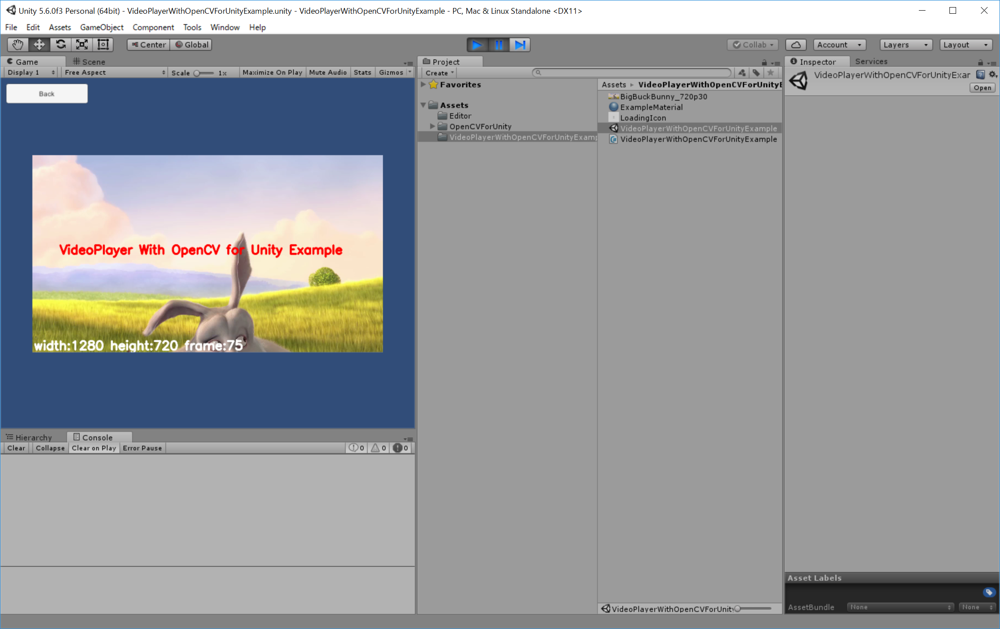

VideoPlayer With OpenCV for Unity Example
====================

Screen Shot
-----

Environment
-----
Unity 5.6.0f3
OpenCVForUnity 2.1.6  

Setup
-----
* Create New Project. (VideoPlayerWithOpenCVForUnityExample)
* Import OpenCVForUnity2.1.6 from AssetStore
* Import VideoPlayerWithOpenCVForUnityExample.unitypackage
