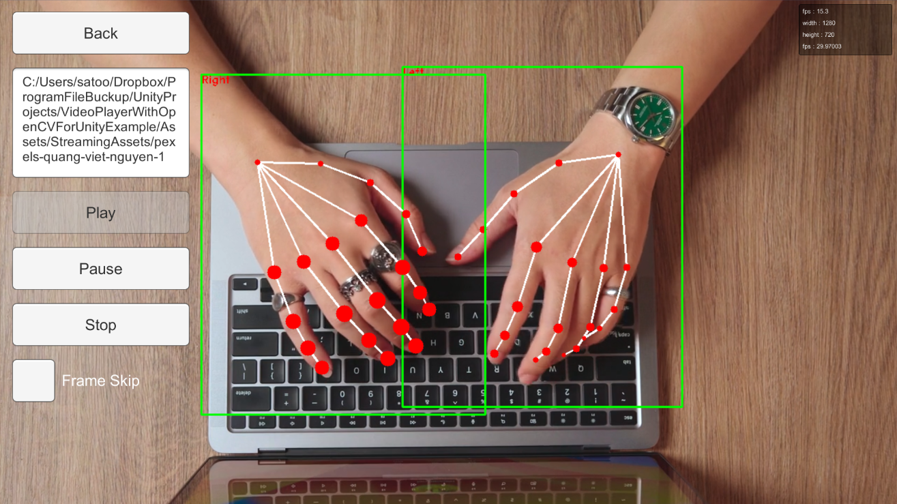

# VideoPlayer With OpenCVForUnity Example
This example shows how to convert VideoPlayer texture to OpenCV Mat using AsyncGPUReadback.
- VideoPlayerOnlyExample
- VideoPlayerWithOpenCVForUnitySyncExample
- VideoPlayerWithOpenCVForUnityAsyncExample

## Environment
- Unity >= 2019.4.31f1+
- [OpenCV for Unity](https://assetstore.unity.com/packages/tools/integration/opencv-for-unity-21088?aid=1011l4ehR) 2.4.6+

## Demo
- Android [VideoPlayerWithOpenCVForUnityExample.apk](https://github.com/EnoxSoftware/VideoPlayerWithOpenCVForUnityExample/releases)

## Setup
1. Download the latest release unitypackage. [VideoPlayerWithOpenCVForUnityExample.unitypackage](https://github.com/EnoxSoftware/VideoPlayerWithOpenCVForUnityExample/releases)
1. Create a new project. (VideoPlayerWithOpenCVForUnityExample)
1. Import OpenCVForUnity.
    * Setup the OpenCVForUnity. (Tools > OpenCV for Unity > Set Plugin Import Settings)
    * Select MenuItem[Tools/OpenCV for Unity/Use Unsafe Code]. 
      
      
1. Import the VideoPlayerWithOpenCVForUnityExample.unitypackage.
1. Add the "Assets/VideoPlayerWithOpenCVForUnityExample/*.unity" files to the "Scenes In Build" list in the "Build Settings" window.
1. Build and Deploy.

## ScreenShot
 
 
 
 

##License
Big Buck Bunny
Copyright (C) 2008 Blender Foundation | peach.blender.org
Some Rights Reserved. Creative Commons Attribution 3.0 license.
http://www.bigbuckbunny.org/