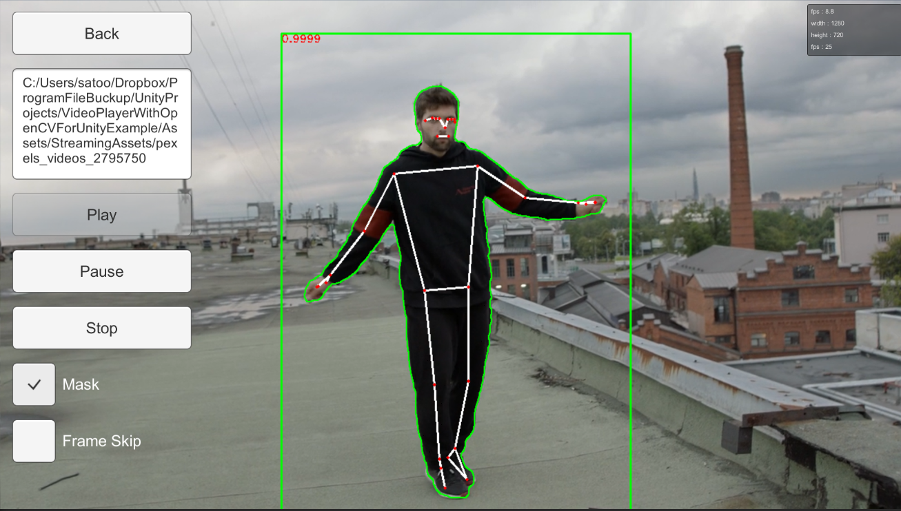

# ⚠️ Archived Repository

This repository is no longer maintained or updated.  
If you want to achieve similar functionality, please use the `UnityVideoPlayer2MatHelper` class included in **OpenCVForUnity version 2.6.4 or later**.  

VideoPlayer With OpenCVForUnity Example
====================

Overview
-----
This example shows how to convert VideoPlayer texture to OpenCV Mat using AsyncGPUReadback.
- VideoPlayerOnlyExample
- VideoPlayerWithOpenCVForUnitySyncExample
- VideoPlayerWithOpenCVForUnityAsyncExample
- VideoPlayerToMatHelperExample
- FaceDetectionYuNetV2Example
- ObjectDetectionYOLOXExample
- HandPoseEstimationMediaPipeExample
- PoseEstimationMediaPipeExample
- VideoCaptureTrackingExample
- VideoPlayerTrackingExample

Environment
-----
- Unity 2020.3.48f1+
- [OpenCV for Unity](https://assetstore.unity.com/packages/tools/integration/opencv-for-unity-21088?aid=1011l4ehR) 2.5.9+

Demo
-----
- WebGL (simd) <https://enoxsoftware.github.io/VideoPlayerWithOpenCVForUnityExample/webgl_example_simd/index.html>
- WebGL (simd, threads) <https://enoxsoftware.github.io/VideoPlayerWithOpenCVForUnityExample/webgl_example_simd_threads/index.html>
- Android <https://github.com/EnoxSoftware/VideoPlayerWithOpenCVForUnityExample/releases>

Setup
-----
1. Download the latest release unitypackage. [VideoPlayerWithOpenCVForUnityExample.unitypackage](https://github.com/EnoxSoftware/VideoPlayerWithOpenCVForUnityExample/releases)
1. Create a new project. (VideoPlayerWithOpenCVForUnityExample)
1. Import OpenCVForUnity.
    * Select MenuItem[Tools/OpenCV for Unity/Open Setup Tools].
    * Click the [Open Example Assets Downloader] button, then click the [FaceDetectionYuNetV2Example],[ObjectDetectionYOLOXExample],[HandPoseEstimationMediaPipeExample],[PoseEstimationMediaPipeExample],[TrackingExample] buttons.
    * Click the [Move StreamingAssets Folder] button.
    * [WebGL] Click the [Enable MultiThreads Support] button or the [Enable SIMD Support] button. Set [Project Settings]-[Other Settings]-[Color Space] to [Gamma].
      
      
1. Import the VideoPlayerWithOpenCVForUnityExample.unitypackage.
1. Add the "Assets/VideoPlayerWithOpenCVForUnityExample/*.unity" files to the "Scenes In Build" list in the "Build Settings" window.
1. Build and Deploy.

ScreenShot
-----
 
 
 
 
